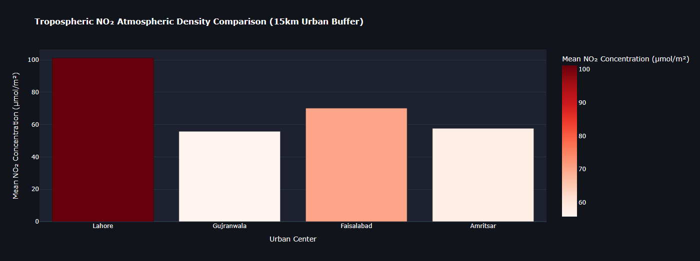

# 🌍 Sentinel-5P Air Quality WebGIS & Spatial Analytics Dashboard



## 📌 Executive Summary
This project presents an interactive **WebGIS software platform** built to monitor and analyze atmospheric air pollution (Tropospheric $\text{NO}_2$) across major urban and industrial corridors. Built with **Streamlit**, **Google Earth Engine (GEE)**, and **Spatial SQL paradigms**, this application enables real-time spatial buffer operations and comparative zonal statistical analysis on European Space Agency (ESA) satellite datasets.

---

## 🛠️ Tech Stack & Architecture
- **Spatial Data Source:** Sentinel-5P TROPOMI (Offline Level-3 Tropospheric $\text{NO}_2$)
- **Spatial Processing Backend:** Google Earth Engine Python API & GeoPandas
- **Web Application Framework:** Streamlit
- **Interactive Visualization:** Folium / Leaflet JS & Plotly Express
- **Database Logic:** Spatial Buffer Operations (`ST_Buffer` & `ST_Intersects` analogues)

---

## 🚀 Key Features
1. **Interactive Spatial Buffer Queries:** Dynamic user-controlled buffer radii (5 km – 50 km) centered over key metropolitan regions.
2. **Real-time Satellite Data Reduction:** On-the-fly mean atmospheric density aggregation directly from cloud archives.
3. **Multi-City Analytics Engine:** Comparative zonal statistical charts evaluating regional pollution loads.
4. **Dark-Mode GIS Interface:** Custom vector tiles rendered with thermal color maps for enhanced contrast and readability.

---

## 💻 Local Installation & Setup

1. **Clone the repository:**
   ```bash
   git clone [https://github.com/YOUR_USERNAME/global-air-quality-postgis-streamlit-webgis.git](https://github.com/YOUR_USERNAME/global-air-quality-postgis-streamlit-webgis.git)
   cd global-air-quality-postgis-streamlit-webgis\
   Install dependencies:

Bash
pip install -r requirements.txt
Launch the Streamlit app:

Bash
streamlit run app.py
📧 Author
Subhan Aspiring Master's Candidate in Geoinformatics & Spatial Data Science
